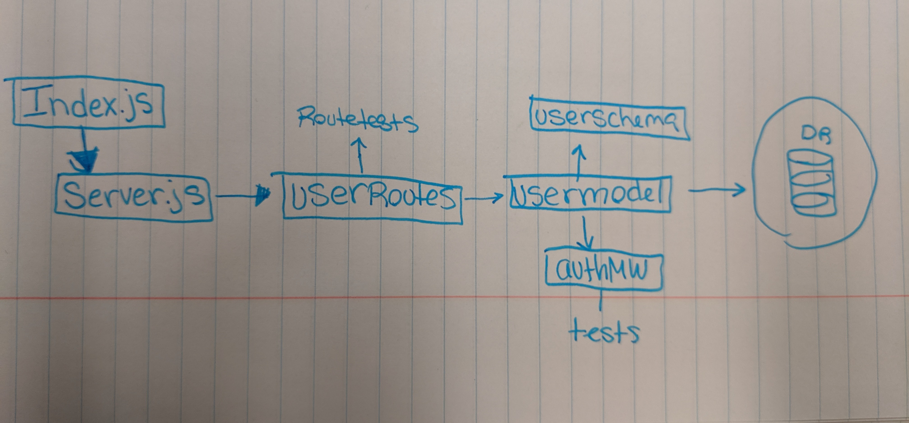

# LAB - Authentication/Authorization

## Labs 11-14

### Author: Natalie Alway

### Links and Resources
* [submission PR](https://github.com/nataliealway-401-advanced-javascript/auth-auth-app/pull/1)
* [travis](https://www.travis-ci.com/nataliealway-401-advanced-javascript/auth-auth-app)

#### Documentation
* [jsdoc](https://github.com/nataliealway-401-advanced-javascript/auth-auth-app/tree/lab11/docs) 

### Setup
#### `.env` requirements
* `PORT` - 3000
* `MONGODB_URI` - URL for running MongoDB
* `CLIENT_ID` - OAuth ID
* `CLIENT_SECRET` - OAuth Secret
* `API_SERVER` - http://localhost:3000/oauth
* `TOKEN_SERVER` - https://github.com/login/oauth/access_token
* `REMOTE_API` - https://api.github.com/user

#### Running the app
* `npm start`

  
#### Tests
* npm test
* echo '{"username":"name","password":"pass"}' | http post :3000/signup
* Lint Tests: 'npm run lint'

#### UML

